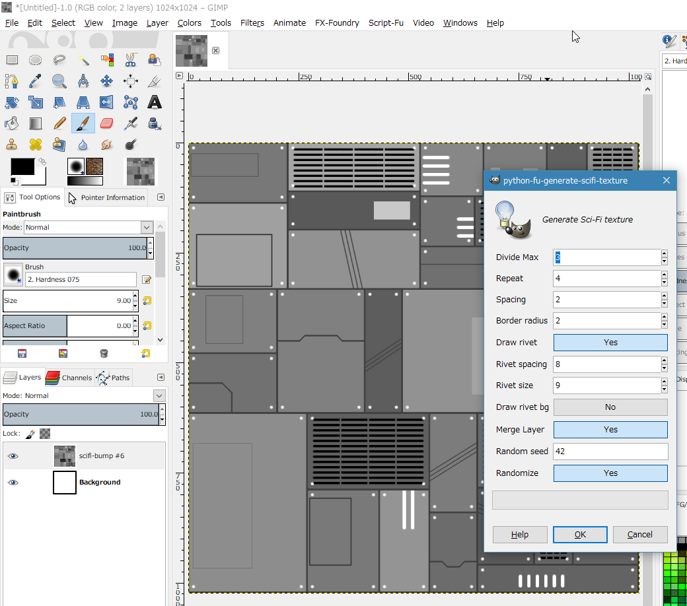
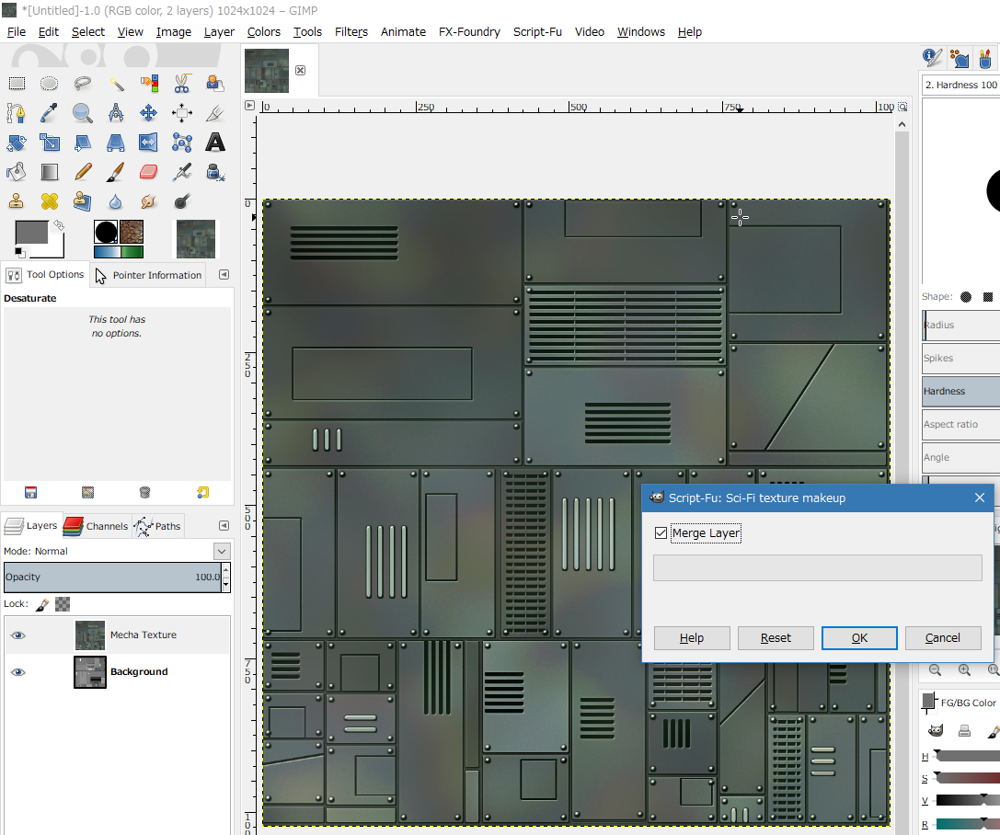

<!-- -*- encoding: utf-8 -*- -->

Sci-Fi-texture-generator
========================

Sci-Fi bump mapping texture generator with GIMP Script-fu.

Table of Contents
-----------------

* [Description](#description)
* [Screenshots](#screenshots)
* [Requirement](#requirement)
* [Usage](#usage)
* [Install](#install)
* [License](#license)
* [Author](#author)

Description
-----------

Generate Sci-Fi bump mapping texture. It is processed by Script-fu of GIMP.

Screenshots
-----------

Requirement
-----------

* GIMP 2.8.22 Portable + Windows10 x64
* GIMP 2.8.16 + Ubuntu Linux 16.04 LTS

Usage
-----

1. Start GIMP.
2. Create new image. 1024x1024 or 512x512 or 2048x2048.
3. Script-Fu -> Render -> Sci-Fi texture 2. You get a bump mapping (B/W) texture.
4. Script-Fu -> Utils -> Sci-Fi texture makeup. You get a RGB texture.

Install
-------

* Copy sci-fi-texture2.py to "GIMP-USER-FOLDER/plug-ins/"
* Copy sci-fi-texture-makeup.scm to "GIMP-USER-FOLDER/scripts/"

### GIMP-USER-FOLDER

* Linux
  *  ~/.gimp-2.8/plug-ins/
  *  ~/.gimp-2.8/scripts/

* Windows10/8.1/7
  *  C:\\Users\\USERNAME\\.gimp-2.8\\plug-ins\\
  *  C:\\Users\\USERNAME\\.gimp-2.8\\scripts\\

License
-------

CC0 / Public Domain

Author
------

[mieki256](https://github.com/mieki256)

