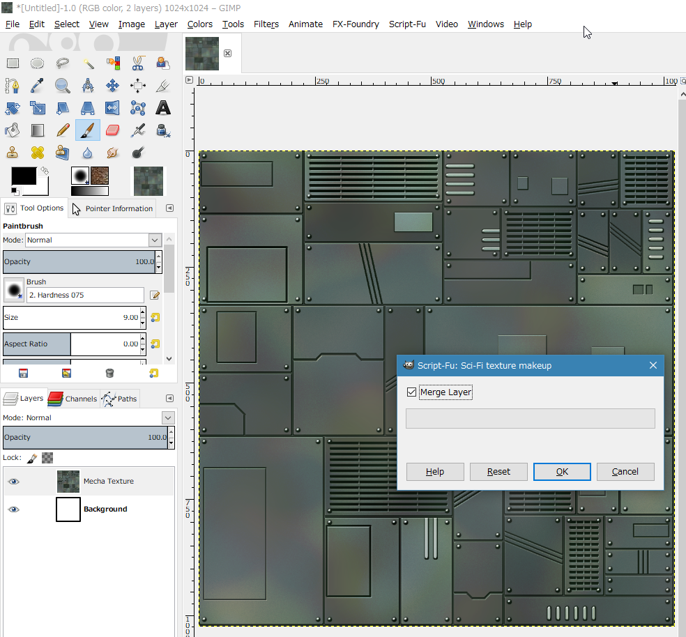

<!-- -*- encoding: utf-8 -*- -->

Sci-Fi-texture-generator
========================

Sci-Fi bump mapping texture generator with GIMP Script-fu.

Table of Contents
-----------------

* [Description](#description)
* [Screenshots](#screenshots)
* [Requirement](#requirement)
* [Usage](#usage)
* [Install](#install)
* [License](#license)
* [Author](#author)

Description
-----------

Generate Sci-Fi bump mapping texture. It is processed by Script-fu of GIMP.

Screenshots
-----------

[Sci-Fi-texture-generator with GIMP Python-fu demo - YouTube](https://youtu.be/P7TMjbHVIVM)

### Output example

[Output sample 01 (1024x1024, png)](./screenshots/sample01.png)

[Output sample 02 (1024x1024, png)](./screenshots/sample02.png)

Requirement
-----------

* Windows10 x64 21H2 + GIMP 2.10.30 Portable
* Windows10 x64 21H2 + GIMP 2.8.22 Portable
* Ubuntu Linux 20.04 LTS + GIMP 2.10.30 (flatpak version)
* Ubuntu Linux 18.04 LTS + GIMP 2.8.22

Usage
-----

1. Start GIMP.
2. Create new image. 1024x1024 or 512x512 or 2048x2048.
3. Filters -> Render -> Sci-Fi texture pycairo. You get a bump mapping (B/W) texture.
4. Script-Fu -> Utils -> Sci-Fi texture makeup. You get a RGB texture.
5. Option. Filters -> Render -> Random boxes pycairo. Set layer mode to softlight. Set opacity to 20.

Install
-------

* Copy sci-fi-texture3_pycairo.py to "GIMP-USER-FOLDER/plug-ins/"
* Copy sci-fi-texture-makeup.scm to "GIMP-USER-FOLDER/scripts/"
* Opyion. Copy random-boxes-pycairo.py to "GIMP-USER-FOLDER/plug-ins/"

### GIMP-USER-FOLDER

* Linux
  *  ~/.gimp-2.*/plug-ins/
  *  ~/.gimp-2.*/scripts/

* Windows10/8.1/7
  *  C:\\Users\\USERNAME\\.gimp-2.*\\plug-ins\\
  *  C:\\Users\\USERNAME\\.gimp-2.*\\scripts\\

License
-------

CC0 / Public Domain

Author
------

[mieki256](https://github.com/mieki256)

