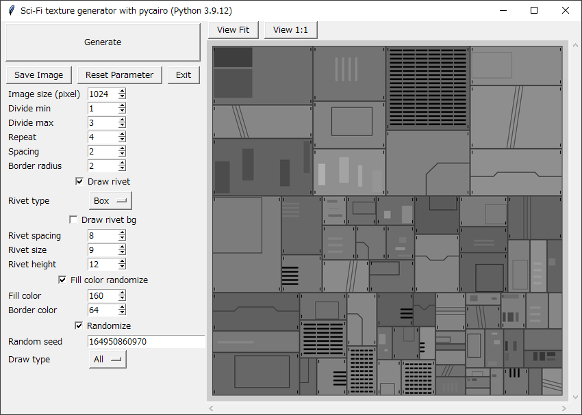

Sci-Fi-texture-generator standalone
===================================

Sci-Fi bump mapping texture generator (standalone).

Description
-----------

Generate Sci-Fi bump mapping texture with pycairo.

Works without GIMP.

Screenshots
-----------

Requirement
-----------

* Python 2.7 or 3.x
* tkinter
* pycairo
* Pillow

### Execution check environment

* Windows10 x64 21H2 + Python 2.7.18 32bit + pycairo 1.8.10 + Pillow 6.2.2
* Windows10 x64 21H2 + Python 3.9.12 64bit + pycairo 1.21.0 + Pillow 9.0.1

Usage
-----

    python scifi_texture_generator_sa.py

License
-------

CC0 / Public Domain

Author
------

[mieki256](https://github.com/mieki256)

